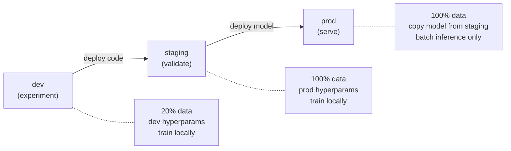
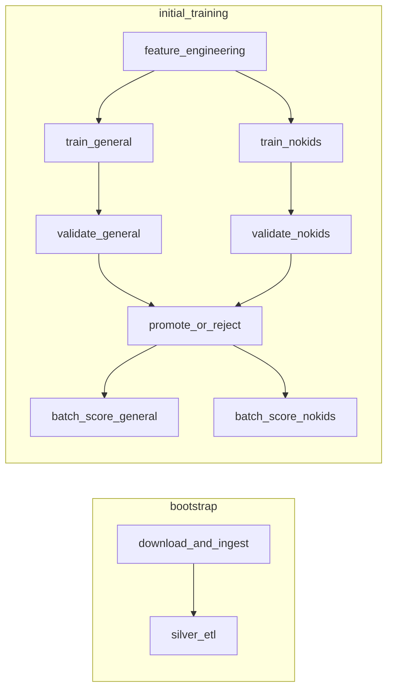
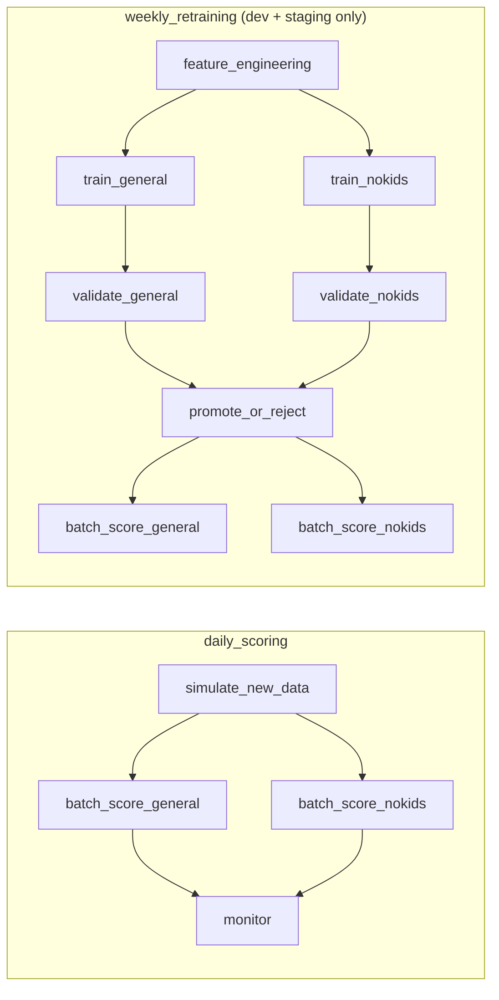
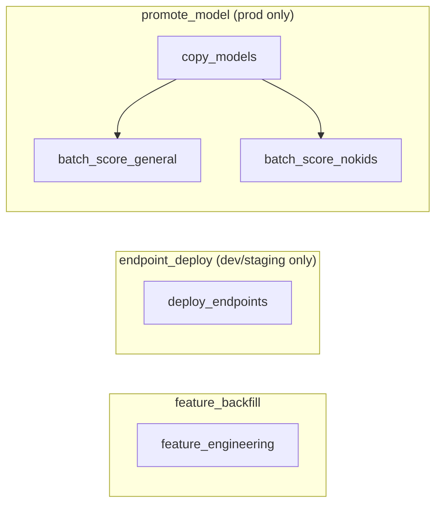
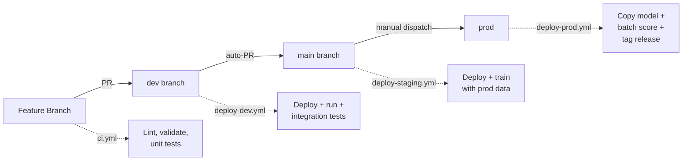

# bricks-ml3 -- Three Environment MLOps Project Template

A production-ready MLOps template for Databricks with three environments
(dev / staging / prod), MLflow 3 model registry, and Unity Catalog integration.

> **Note:** This is an independent, personal project -- not a Databricks product.
> Databricks does not offer official support for this repository.
> For issues, please [open a GitHub issue](https://github.com/CausalBit/bricks-ml3/issues);
> responses are provided on a best-effort basis.

## Overview

bricks-ml3 provides a complete, opinionated MLOps scaffold: medallion data pipelines,
Feature Store integration, automated model validation, batch scoring, drift
monitoring, and CI/CD -- all wired together with Databricks Asset Bundles.

The included example uses the [MovieLens 25M](https://grouplens.org/datasets/movielens/25m/)
dataset to train a LightGBM multi-output regression model that predicts user
genre propensity across 18 genres. Two model variants are produced:

- **General** — all 18 genres
- **No-Kids** — excludes Children, Animation, and Fantasy (15 genres)

Replace the example domain logic with your own dataset and model while keeping
the three-environment infrastructure intact.

## Quick Start

### Prerequisites

- Python >= 3.10
- [Databricks CLI](https://docs.databricks.com/dev-tools/cli/index.html) configured with a `DEFAULT` profile
- Access to a Databricks workspace with Unity Catalog enabled

### Local Setup

```bash
python -m venv .venv
source .venv/bin/activate
pip install -r requirements.txt
pip install -e ".[dev]"
```

### Deploy and Run (dev)

```bash
databricks bundle validate -t dev
databricks bundle deploy -t dev
databricks bundle run -t dev bootstrap          # seed data (once)
databricks bundle run -t dev initial_training   # train first models (once)
```

## Architecture

### Hybrid deployment pattern



Dev and staging use **deploy code** — each trains its own models. Staging
trains with production-scale data so the model is validated under real
conditions. Prod uses **deploy model** — it copies the `@Champion` artifact
from staging rather than retraining. The validated model is the exact artifact
that serves.

See [Deploy Code vs. Deploy Model](docs/deploy-code-vs-deploy-model.md) for
the full comparison.

### Environments

| | dev | staging | prod |
|---|---|---|---|
| **Catalog** | `dsml_dev` | `dsml_staging` | `dsml_prod` |
| **Branch** | `dev` | `main` | `main` (manual) |
| **Data** | 20% of users | 100% of users | 100% of users |
| **Hyperparameters** | `HYPERPARAMS_DEV` | `HYPERPARAMS_PROD` | `HYPERPARAMS_PROD` |
| **Deployment** | Deploy code | Deploy code | Deploy model |
| **Training** | On push / manual | On push to main / weekly | Never |
| **Scoring** | Manual | Daily 06:00 UTC | Daily 06:00 UTC |

### Compute resources

Jobs use two cluster profiles sized per environment:

| Cluster | Purpose | dev (20%) | staging (100%) | prod |
|---------|---------|-----------|----------------|------|
| `etl_cluster` | Distributed Spark (features, ETL) | Single node | 1 + 2 workers | 1 + 2 workers |
| `training_cluster` | Single-node sklearn (`toPandas()` + `model.fit()`) | D8ds_v5, 16g | E8ds_v5, 48g | N/A |

Staging uses a memory-optimized driver (`E8ds_v5`, 64GB RAM) because
`toPandas()` collects the full dataset (~162K users x 18 genres) to driver
memory. Dev's 20% subset fits on a standard node. Prod never trains.

### Pipeline

#### Setup jobs (run once per environment)



#### Operational jobs (scheduled)



#### Utility jobs (on demand)



| Job | Schedule | Purpose |
|---|---|---|
| `bootstrap` | Once | Download ML-25M, write bronze tables, run silver ETL |
| `initial_training` | Once | Build features, train + validate both models, batch score |
| `daily_scoring` | Daily 06:00 UTC | Simulate new data, batch score, detect drift |
| `weekly_retraining` | Sunday 04:00 UTC | Retrain both models, validate, promote or reject |
| `feature_backfill` | On-demand | Rebuild gold feature tables |
| `endpoint_deploy` | On-demand | Create serving endpoints (dev/staging only) |
| `promote_model` | On-demand | Copy @Champion from staging to prod, batch score |

### CI/CD



For the full CI/CD walkthrough — workflows, automatic job detection, production
deployment, bootstrapping, and rollback — see the
[Model Promotion Guide](docs/model-promotion-guide.md).

## Project Structure

```
bricks-ml3/
├── databricks.yml                  # DABs bundle config (targets, variables)
├── resources/jobs.yml              # All 7 job definitions
├── scripts/                        # Operational scripts
│   ├── setup_catalog.py            # Create catalog, schemas, volumes, grants
│   ├── check_readiness.py          # Pre-job environment validation
│   ├── detect_changes.sh           # File-change → test/job mapping for CI
│   └── rollback_model.py           # CLI model alias rollback
├── src/
│   ├── bricks_ml3/            # Python library package
│   │   ├── config/settings.py      # All constants, thresholds, hyperparams
│   │   ├── ingestion/              # CSV → bronze Delta tables
│   │   ├── transformations/        # Silver + gold pipelines
│   │   ├── training/               # LightGBM + MLflow
│   │   ├── validation/             # 10-check model validation
│   │   ├── deployment/             # Champion promotion + model copy
│   │   ├── inference/              # Batch scoring
│   │   ├── monitoring/             # Drift detection (PSI)
│   │   └── utils/                  # Spark helpers, catalog resolution
│   └── notebooks/                  # Databricks notebooks (thin wrappers)
│       ├── 00–10                   # Pipeline stages
│       └── 11_copy_model_to_prod   # Cross-catalog model promotion
├── tests/
│   ├── unit/                       # Fast, local PySpark tests
│   └── integration/                # Databricks Connect tests
└── docs/                           # Detailed guides
```

## Configuration

All constants live in `src/bricks_ml3/config/settings.py`. The `catalog`
variable is injected by DABs and flows through every table reference as
`{catalog}.{schema}.{table}`. No hardcoded catalog names appear in the codebase.

Key DABs variables per target:

| Variable | dev | staging | prod |
|----------|-----|---------|------|
| `sample_fraction` | 0.2 | 1.0 | 1.0 |
| `hyperparams_profile` | dev | prod | prod |
| `etl_num_workers` | 0 | 2 | 2 |
| `training_node_type_id` | D8ds_v5 | E8ds_v5 | D8ds_v5 |
| `driver_memory` | 16g | 48g | 16g |

## Further Reading

- **[Model Promotion Guide](docs/model-promotion-guide.md)** — the complete operational reference: CI/CD workflows, promotion steps, validation checks, rollback, bootstrapping, and infrastructure
- **[Deploy Code vs. Deploy Model](docs/deploy-code-vs-deploy-model.md)** — trade-offs between the two MLOps deployment patterns
- **[Expanding the Project](docs/expanding-the-project.md)** — how to add features, model variants, and training frameworks
## Disclaimer

This project is not developed, endorsed, or supported by Databricks, Inc.
It is an independent, personal project provided under the Apache License 2.0,
"AS IS" without warranty of any kind. Use at your own risk.

Databricks does not offer official support for this repository. For any
issues with this project or its assets, please
[open a GitHub issue](https://github.com/CausalBit/bricks-ml3/issues).
Responses are provided on a best-effort basis.
