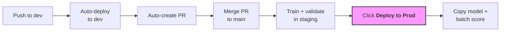
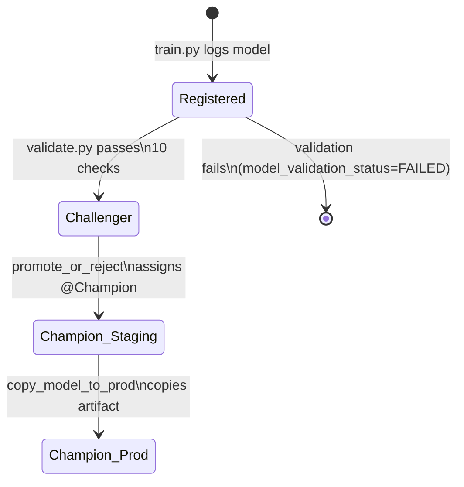

# Model Promotion Guide

The complete operational reference for this project's CI/CD pipeline, model
promotion lifecycle, and infrastructure. For architecture overview and quick
start, see the [README](../README.md).

---

## TL;DR for Data Scientists



**To promote:** merge the auto-PR from `dev` to `main`, verify staging, then run **Actions > Deploy to Prod**.
**To roll back:** Actions > Rollback > type `rollback`.

---

## Deployment Pattern

This project uses a **hybrid** approach:

- **Dev and staging** use **deploy code** — each trains its own models
- **Staging → prod** uses **deploy model** — the validated model artifact is copied, not retrained

Staging trains with **production-scale data** (100% users, prod hyperparams).
The model validated in staging is the exact artifact that serves in prod. Prod
never trains — it only receives the proven model and runs batch inference.

See [Deploy Code vs. Deploy Model](deploy-code-vs-deploy-model.md) for the
pattern comparison.

---

## Model Lifecycle



Models are registered at `{catalog}.ml.genre_propensity_general` and
`{catalog}.ml.genre_propensity_nokids`. The `promote_or_reject` step requires
**both** variants to pass validation. If either fails, the notebook raises an
error and the Databricks job fails — downstream batch scoring does not run.

---

## Step-by-Step: Code Change to Production

### 1. Push to dev

Edit training code, features, or hyperparameters. Push to `dev`.

### 2. Dev deployment (automatic)

`deploy-dev.yml` deploys to `dsml_dev` and auto-detects the appropriate job
based on which files changed. Integration tests run after deploy.

### 3. Auto-PR created

`promote.yml` creates (or updates) a PR from `dev` → `main` with a commit
list and a link to the dev workflow run.

### 4. Merge to main

Review dev results, merge the PR.

### 5. Staging deployment (automatic)

`deploy-staging.yml` deploys to `dsml_staging` with **prod-scale config**
(100% data, prod hyperparams). If training code changed, `weekly_retraining`
runs and the model must pass all 10 validation checks.

### 6. Deploy to Prod (manual)

Go to **Actions > Deploy to Prod > Run workflow**, type `deploy`.

The workflow:
1. Verifies the last staging deploy succeeded
2. Deploys code to `dsml_prod`
3. Runs `promote_model` — copies `@Champion` from `dsml_staging` to `dsml_prod`
4. Batch scores both model variants
5. Tags a GitHub release

No training happens in prod. The model that passed validation in staging is the
exact artifact that serves.

---

## CI/CD Workflows

### Branching strategy

Work happens on feature branches, merged to `dev` via PR. CI gates every PR
with lint, bundle validation, and targeted unit tests. Merging to `dev`
triggers a deploy, and on success `promote.yml` opens a PR from `dev` to
`main`. Merging that PR triggers the staging deploy. After verifying staging,
a data scientist manually triggers **Deploy to Prod**.

### Workflow reference

| Workflow | Trigger | Purpose |
|----------|---------|---------|
| `ci.yml` | PR to `dev` or `main` | Lint, bundle validate, targeted unit tests |
| `deploy-dev.yml` | Push to `dev` | Deploy, auto-detect job, integration tests |
| `promote.yml` | After successful dev deploy | Auto-create/update PR `dev` → `main` |
| `deploy-staging.yml` | Push to `main` | Deploy + auto-detect job (trains with prod data) |
| `deploy-prod.yml` | Manual dispatch | Verify staging → deploy code + copy model + tag release |
| `rollback.yml` | Manual dispatch | Model alias revert (fast) or code re-deploy |
| `run-job.yml` | Manual dispatch | Run any job on any target without redeploying |
| `setup-environment.yml` | Manual dispatch | Bootstrap: `bootstrap` then `initial_training` or `promote_model` |

All deploy workflows share `_reusable-deploy.yml` which handles catalog setup,
bundle deploy, change detection, readiness checks, and job execution.

### Automatic job detection

`scripts/detect_changes.sh` inspects which files changed and picks the right
post-deploy job. Priority order (highest wins when multiple domains change):

| Changed files | Auto-detected job | Tests run |
|---|---|---|
| `training/`, `validation/`, notebooks 04/05/09 | `weekly_retraining` | `test_train.py`, `test_validate.py` |
| `transformations/gold.py`, notebooks 03/08 | `feature_backfill` | `test_gold.py` |
| `inference/`, `monitoring/`, notebooks 07/10 | `daily_scoring` | — |
| `deployment/`, notebooks 06/11 | `endpoint_deploy` | — |
| `config/`, `utils/`, `setup.py`, `requirements.txt` | `weekly_retraining` | all unit tests |
| `databricks.yml`, `resources/`, `scripts/`, `.github/` | _(deploy only)_ | — |
| docs, README, project_specs | _(skip deploy)_ | — |

All deploy workflows accept a manual `run_job` override to force a specific job
or `none` to skip.

### Why production deployment is manual

- **Inspect before you ship.** Staging trains with 100% of production data and
  prod hyperparameters. A manual gate lets you review training job logs, model
  metrics, and validation results before the model reaches production.
- **The validated artifact _is_ the deployed artifact.** Prod copies the model
  from staging instead of retraining — no non-determinism risk. A manual gate
  costs minutes; a bad model in prod costs hours.
- **Rollbacks stay simple.** Every production release maps to a deliberate
  action and a tagged version.

### Branch-to-target validation

`run-job.yml` and `setup-environment.yml` enforce dispatch from the correct ref:

- **dev** → `dev` branch
- **staging** → `main` branch
- **prod** → `main` branch

---

## The 10 Validation Checks

Every model version runs through these checks in
`src/bricks_ml3/validation/validate.py` before earning the `@Challenger` alias.
All thresholds are in `src/bricks_ml3/config/settings.py`.

| # | Check | Threshold |
|---|-------|-----------|
| 1 | Artifact loadable | `load_model()` succeeds |
| 2 | Description present | Non-empty |
| 3 | Input signature | Not `None` |
| 4 | Smoke test | 5 rows, non-null predictions |
| 5 | Overall RMSE | < 1.5 |
| 6 | Overall R-squared | > 0.05 |
| 7 | Champion comparison | Challenger RMSE ≤ Champion RMSE |
| 8 | Per-genre RMSE | Every genre < 2.0 |
| 9 | Activity slices | R² > -0.05 for low/medium/high users |
| 10 | Governance tags | Auto-set on pass |

### What happens when validation fails

1. Model tagged `model_validation_status=FAILED`. No alias assigned.
2. `promote_or_reject` raises `RuntimeError` — job fails, batch scoring skipped.
3. Current `@Champion` continues serving. No impact to consumers.
4. In staging, the failed workflow means the data scientist does not promote to
   prod.

### Diagnosing failures

- **Job logs**: the `validate_*` task logs each check with actual vs. threshold
- **MLflow**: `/Shared/genre_propensity/{catalog}/validation` experiment
- **Model tags**: `holdout_rmse_overall`, `holdout_r2_overall` in Unity Catalog

---

## Infrastructure & Resources

### Cluster profiles

Jobs use two cluster profiles to match workload characteristics:

| Cluster | Workload | Tasks | Workers |
|---------|----------|-------|---------|
| `etl_cluster` | Distributed Spark joins + I/O | feature_engineering, silver_etl, simulate_new_data, batch scoring (daily) | Per-environment |
| `training_cluster` | Single-node pandas/sklearn | train, validate, promote, batch score, model copy | Always 0 (`local[*]`) |

Training uses `MultiOutputRegressor(LGBMRegressor)` via sklearn, which runs
entirely on the driver after `toPandas()` collects the full dataset. Workers
are idle during `model.fit()`, so training tasks use a single-node cluster
with a memory-optimized driver instead.

### Per-environment sizing

| Variable | dev (20% data) | staging (100% data) | prod (no training) |
|----------|---------------|---------------------|-------------------|
| `etl_node_type_id` | D8ds_v5 (32GB) | D8ds_v5 (32GB) | D8ds_v5 (32GB) |
| `etl_num_workers` | 0 | 2 | 2 |
| `training_node_type_id` | D8ds_v5 (32GB) | E8ds_v5 (64GB) | D8ds_v5 (32GB) |
| `driver_memory` | 16g | 48g | 16g |

**Why staging needs a bigger driver:** At 100% data, `toPandas()` collects
~162K users x 18 genres of labels plus all pivoted feature columns into driver
memory. With dev hyperparams (20% data), this fits in 16GB. At full scale, the
driver needs ~48GB to avoid OOM during the Feature Store training set
collection.

**Why prod doesn't need a training cluster:** Prod never trains. The
`promote_model` and `daily_scoring` jobs only run batch scoring (single-node
`mlflow.pyfunc` inference) and Spark ETL, both handled by the ETL cluster.

---

## Rollback

Go to **Actions > Rollback > Run workflow**.

### Model rollback (fast — seconds)

Reverts `@Champion` to the previous model version. Use when the latest model
is bad but code is fine.

- Target: **prod**, Mode: **model**, type `rollback`

### Full rollback (code re-deploy)

- **Prod**: Re-deploys old release tag code only (`run_job: none`). Combine
  with model rollback to also revert the model alias.
- **Dev/staging**: Re-deploys old tag and retrains.

### CLI rollback

```bash
python scripts/rollback_model.py --target prod                 # previous version
python scripts/rollback_model.py --target prod --version 5     # specific version
python scripts/rollback_model.py --target prod --dry-run       # preview
```

---

## Bootstrapping a New Environment

### Via GitHub Actions (recommended)

1. Go to **Actions > Bootstrap Environment > Run workflow**
2. Select the target (dev, staging, or prod)
3. The workflow runs `bootstrap` then `initial_training` (dev/staging) or
   `promote_model` (prod)
4. **For prod:** staging must be bootstrapped first — prod copies from staging

### Manual from your machine

```bash
python scripts/setup_catalog.py --target dev
databricks bundle deploy -t dev
databricks bundle run -t dev bootstrap
databricks bundle run -t dev initial_training
```

---

## Manual Overrides

### Run a job without redeploying

**Actions > Run Job**: pick target and job.

### Re-run retraining in staging

```bash
databricks bundle run -t staging weekly_retraining
```

### Force-promote a model in dev/staging

The `endpoint_deploy` job promotes `@Challenger` to `@Champion` and creates
serving endpoints. Run via Run Job or:

```bash
databricks bundle run -t staging endpoint_deploy
```
